<h1 align="center">
  
   
  <!--  -->
</h1>

    
     
    
    
     
    
    
     
    
    
    
    
    
      

# Support
If you find my projects helpful, consider supporting development:
- [GitHub Sponsor](https://github.com/sponsors/ddc)
- [ko-fi](https://ko-fi.com/ddcsta)
- [PayPal](https://www.paypal.com/ncp/payment/6G9Z78QHUD4RJ)
